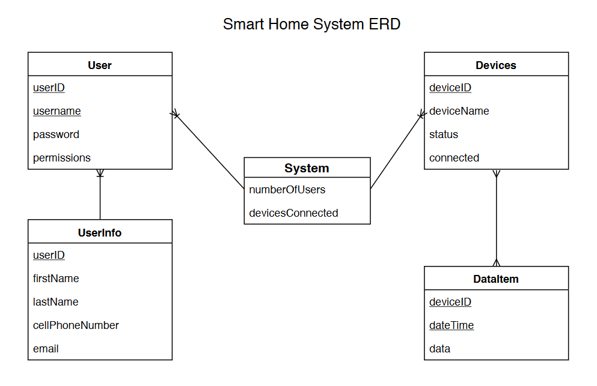

# Sprint 1 Design Document 

## Deployment Environment

- Our first step was creating a virual environment for zephyr to run inside. From here we were able to activate and enter the VM. 
- After installing the needed tools such as homebrew, additional python packages, and west, we were then able to clone the zephyr source code from the repository onto our local machine.
- Next we downloaded a toolchain for zephyr to use, and moved it to home/opt, for this is where zephyr looks for the toolchain by default.
- From here we were able to set up the build environment, as well as build the application. We also had to set the toolchain variable and the zephyr variant in order for our board to recognize it
- Lastly we found a board that acts as an emulator, so we were able to see output from our terminal by running 'ninja run'
- We chose the DBOARD QEMU cortex_m3 because of its emulator capabilities, this way a physical board or server isnt necessary to visualize the output  
- Right now there is no data that we feel the need to keep safe and store during reset, so a database wont be needed with our project

## Functional Requirements

1. Parent Use Case
	- The emulator should allow full access to the data and handling capabilities to the parent
	- A button, that can only be pressed by the parent, will simulate the use of appliances
	- A drop down menu will show all connected appliances, and can allow "off" and "on" functionality
	- Create a login page with all 3 actors, and force a password input if logging in as parent
	- Set a cookie for the parent password
2. Grandparent Use Case		
	- The grandparent can login from the main page
	- From their dashboard, the grandparent can:
		- Push a button to call for help
		- Message other users (family members)
		- Monitor the children
3. Children Use Case
	- Through the server, music can play from the local machine
	- Implement a function that allows lights to be turned off and on
	- Alert box will be displayed to alert the parent of the childs whereabouts

## Database Design

### ERD

**some kind of logical ERD, at least, that lets us know what data is being managed**

 

## Files that are stubbed out in your repository, with comments about the use cases they are connected to. These sections may not all exist for the Zephyr project teams. Simply explain them as best you can. 

### User Interface Files

1. index.html - This will house our forms for user input, and will produce the alerts to the users
	- This file is connected to all 3 use cases
2. info.php - This file will connect the zephyr code to our server, in short, the backend
	- This file is mostly associated with the parent, for they are the admins dealing with the data

### Model Files (File Access)

1. main.c - This file produces the output, and in the later steps of this project will allow connections between other files
	- This file will also allow us to open, read, and output functionality to the server
	- This file is associated with the parent and grandparent, for they will be handling the data sent between each other

### Controller Files (API or other)

1. Twilio - This API will allow the grandma to send messages to the parent, and vice versa
	- This file/API is associated with the grandparent use case, in particular the message section
2. etc. 

## Describe languages you need to use, and any gaps in skills on your team. 

1. Python 
	- Some members have base knowledge with this language, but will need to build on this in order to complete our project.
2. C
	- Due to previous courses taken here at Mizzou, we are all well equipped to write functioning code in C.
3. Skill gaps, if any, otherwise specify who is doing what
	- Gap 1: None of us have experience with emulators, or how zephyr interacts with it
		- All of us will be contributing to this gap, for this is the soul of our project build
	- Gap 2: None of us have done connections between zephyr and a server
		- Again this is all of us contributing, with Jason and Clark taking the lead, for we have both taken web development classes. 
