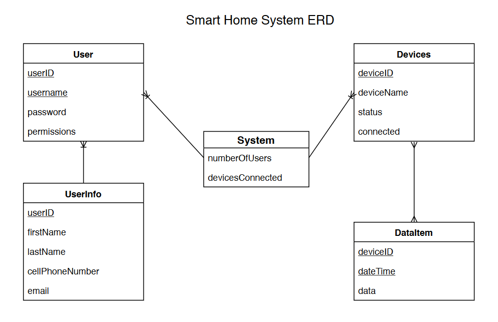

# Sprint 2

## Feature Backlog

### Zephyr Teams
1. Provide a "README.md" file that provides a full set of instructions for installing and configuring a version of your system that implements at least one of your use cases. All three is great, but your teams are in different places.
	- The README.md can be found in our repo, named sprint2README.md

2. Describe what board's or emulators your final product will use. Be specific. This will be a commitment at this point.
	- We will be using the DBOARD QEMU cortex_m3 board/emulator, for it allows printing to the command line which will be helpful for us.

## General Design

1.	Clarify functional requirement specs for your use cases through conversations with stakeholders via Slack for Augur and Zephyr
	- Our functional requirements haven't really changed from Sprint 1, and from watching the Slack channel we feel we are on the right path
	- We have implemented our Grandparent Use Case, but in terms of the other 2 Use Cases we don't know if our requirements need to change
		- These changes will be seen in Sprint 3 and onward, when implementation occurs
2.	Make any necessary changes to your ERD. Save this new ERD in GitHub and link it to the Sprint 2 wiki page.
	- Our ERD still fleshes out our project in a manner we agree with, so we didnt see it neccessary to make any changes

3.	Design Document below
	- what is necessary for your whole system to work
		
		– Data Sources: data comes from the user and stored in the input variable, login data will also be stored on the EC2 instance
		- Other data: We have created a base database through SQL, and will be implementing its connection when the other Use Cases that need it are implemented as well.
		- Functions: main(), callHelp(), messageOthers(), notifyParents()
		- The rest of the inventory: DBOARD QEMU cortex_m3, project files, EC2 instance, and possibly a database in the future, but isnt needed at this point in time for sprint 2
	- Show clearly how the different software components communicate.
		- the board allows for communication between the project build and the user
		- The EC2 instance provides a user friendly UI for the grandparent in this Use Case to access
		- the buttons on the website allows for communication to the user, visually showing them when something has happened
	- Document the reasons for your decisions where you have choices in design.
		- At first the command line was our way of user interaction, but we felt it was a little too primitive for a grandparent
			- The user input was also giving us many errors, so a switch seemed mandatory
		- We have now switched to a EC2 instance/server to allow the users to see our project through a more "user friendly" lens
			- In sprint 3 we also plan on connecting a database to this server, to allow for storage of login information, etc.

4.	Mock up a full visual design, even it its a pencil sketch, for all the ways users interact with your system.
	- here is the visual design of user inputing on the command line

	- Here is the visual design of the EC2 instance running for user interaction (link provided)
[EC2 Instance](http://ec2-18-220-233-118.us-east-2.compute.amazonaws.com/SmartHome/)

## Coding

1.	Add all the code for your first full working prototype, following your design decisions, and save it in GitHub.
	- All files have been added to our github repo.
		- The files listed in sprint2README.md can be found with their respective names in the zephyrCode folder
		- The server/UI files can be found in the UI folder in our github repo

## Troubles:

### Command line difficulties
- zephyr is harder to install on a virtual linux environment. Currently problems with cmake are causing crashes.
- Some standard C commands do not work properly (possibly due to it trying to simulate a specific board?), like the input-output commands. It is hard to do any kind of file io. Possibly there is a way to make it work in a linux environment. This made our initial plan, to save data to a file and then run code in another language on top of it, impractical.

### Zephyr artificial boards
- 96_ArgonKey should be able to pick up sounds. However, after building and running ninja run on Zephyr's microphone sample code designed for this board, it outputs: "Emulation/Simulation not supported with this board". It would be nice to have this up and running for the children's use case. 
- There seem to be a number of features that only work on linux (possibly including the fake boards), so an attempt was made to get a linux virtual environment up and running. There was as much troubleshooting needed to get the linux system up and running as for getting the mac up and (somewhat) running.
