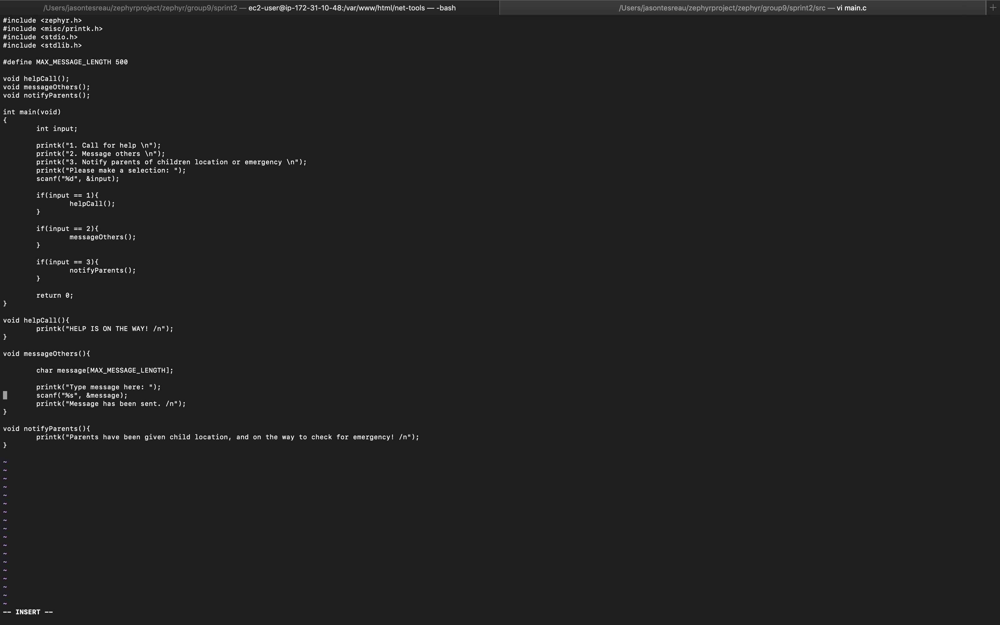

# Sprint 2 README

## Instructions for System Setup

1. By using the hello_world sample given by the Zephyr repository, we were able to reverse engineer this into our own project.
	- First we made directories that lined up with the samples and hello_world, so we created group9 and sprint2 directories
	- From here we made the following files so the project would build successfully
		- CMakeLists.txt
		- prj.conf
		- main.c
	- There is a mandatory change in the CMakeLists.txt file, for the project path needed to be changed to sprint2 in order to find our specific project build
	- The main.c file can be found in the src directory, and is where our code is written

2. Now that the code has been written we are able to try and run the build
	- You must first set the source zephyr-env.sh
	- Next is creating the build directory
	- After this make sure to set your toolchain and zephyr variant
	- Lastly cmake the board or emulator you've chosen, then from here use 'ninja run' to complete the build
		- Below is an image of the board producing output for the user to interact with, allowing the functions seen in the main.c file to run

 

